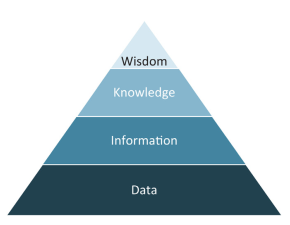

# Introduction to Data Warehousing

## History of Data Warehousing

### Decision Supports Systems

A DSS is comprised of an analytical models database that is fed with selected data extracted from source systems.

### Data Warehouse Systems

> A **data warehouse system (DWH)** is a data-driven decision support system that supports the decision-making process in a strategic sense and, in addition, operational decision-making, for example real-time analytics to detect credit card fraud or on-the-fly recommendations of products and services
> 

Data Warehouse provides subject-oriented data that is integrated and consistent

Data must be loaded must ve loaded from source systems into the data warehouse. To do so, they lust be cleansed, which is part of the loading process of a data mart.

> A **data mart** is a subset of a data warehouse focused on a particular line of business, department, or subject area. Data marts make specific data available to a defined group of users, which allows those users to quickly access critical insights without wasting time searching through an entire data warehouse. For example, many companies may have a data mart that aligns with a specific department in the business, such as finance, sales, or marketing.
> 

Sometimes we need to make aggregations to fit the required granularity. In most cases, data warehouse engineers follow the foal to load at the finest granularity possible, to allow multiple levels for analysis.

Historic data is kept : all data that has been loaded into the data warehouse is sotred and made available for time-variant analysis.

## The Enterprise Data Warehouse Environment

Instead of focusing on a single subject area for analysis, an enterprise data warehouse tries to represent all of an organization’s business data and its business rules.

### Single Version of Truth

The goal is to have a single version of truth, despite synchronization and distribution possible. issues. If there are many versions of truth, it’s up to the business to decide how to cleanse the data when loading it into EDW. In some cases, an automatic selection and validation based on business rules is sufficient. In other cases, a manual selection is required to achieve a validated, single version of truth.

### Mission criticality

If source systems don’t provide the raw data in the required quality, it is the job of the data warehouse to fix any data quality issues and improve the data quality by means of data cleansing, data integration or any other useful methods

### Scalability

The architecture should be built a way that supports adding more data, not only more data volume, but also more complex data.

It’s possible to distribute the data warehouse across multiple machines and fully use the capabilities of the added hardware. This concept is called **Massively Parallel Processing (MPP)**.

Could be complex to change data warehouse because of dependencies. First version can be easliy done, but the second one takes more time.

### Big Data

Big data is data having three characteristics: volume, velocity and variety

Big data don’t necessarily use relational tables, but can use “unstructured” ones, like linguistic structures as in a text.

### Complexity

Complexity comes from sourcing issues, transformation issues, and target issues.

A common reason for these issues is that many data warehouse systems are trying to achieve too much in one loading cycle instead of splitting up the work.

### Auditing and compliance

We should be able to provide information about the source of a data. This is harder with aggregated data. For this, we add metadata.

### Other business requirements

Data warehouse designers try to prevent changes by careful planning and anticipatory design. In such approaches, there are often four phases:

1. Setting up the requirements for the data warehouse
2. Architectural planning and design of the data warehouse
3. Development of the data warehouse
4. Testing of the data warehouse

## Introduction to Data Vault 2.0

Data Vault really represents a *system of business intelligence*. The true name is **Common Foundational Warehouse Architecture**.

Data Vault 1.0 mainly focused on Data Vault Modeling: a dedication to the physical and logical data models. The 2.0 version has expanded it and now includes many necessary components. These components are:

- Modeling: changes to the model for performance and scalability
- Methodology: following Scrum and Agile best practices
- Architecture: including NoSQL systems and big-data systems
- Implementation: pattern based, automation, generation CMMI (Capability Maturity Model Integration) level 5

## Data Warehouse Architecture

Common data warehouse architectures are based on layered approaches.

### Typical Two-Layer Architecture

The raw data from the source systems is loaded into the stage area. The main purpose of the stage area is to reduce the number of operations on the source system and the time to extract the data from it. A stage area is required when the transformations are complex and cannot be performed on-the-fly of when data arrives from multiple source systems at different times.

Once loaded to the stage area, time to load them into the data warehouse.

Advantages: easy to build a dimensional store from the source data

Disadvantage: more complex to build a second dimensional model from the same source data because the data needs to be loaded again from the staging. It’s not possible to reuse existing ETL packages.

### Typical Three-Layer Architecture

It introduces an atomic data warehouse, often a normalized operational data store (ODS) between the staging area and the dimensional model. The data warehouse hold raw data modeled in 3NF. It integrates all data of the enterprise.