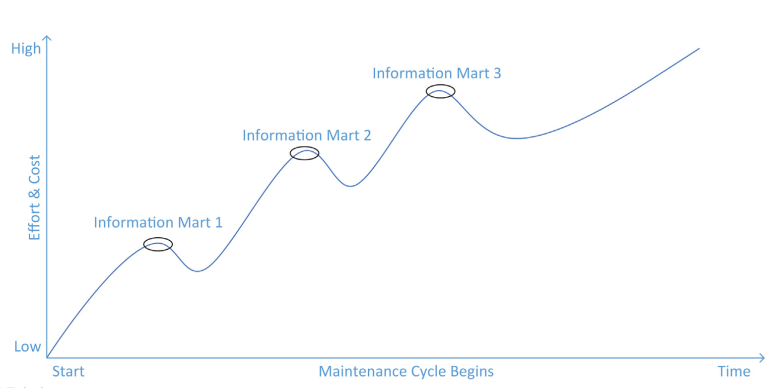
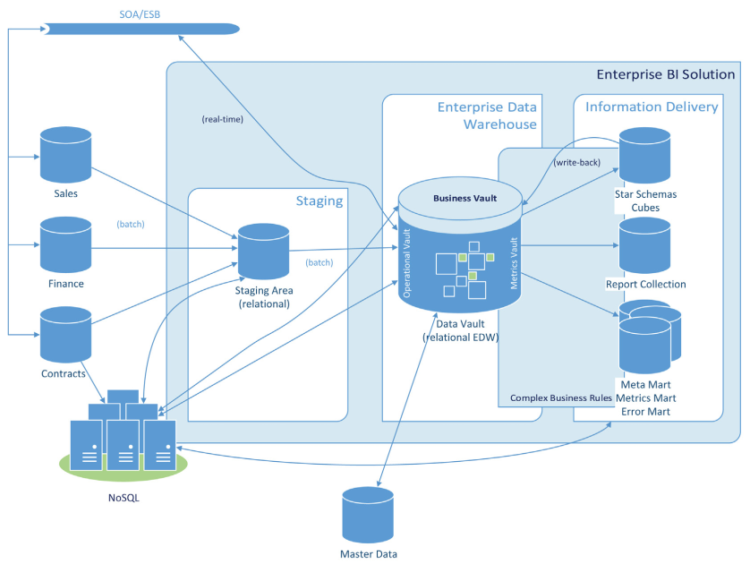
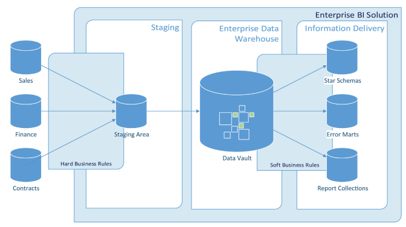

# Scalable Data Warehouse Architecture

Best approach for developing a data warehouse is an iterative development process (like in AGILE).

When implementing new marts, the team has to maintain the older ones. So the first one to implement is done quickly, then is goes longer.

## Dimensions of Scalable Data Warehouse Architectures

Because EDW is “by far the largest and most computaionally intense business application” in a typical enterprise, it’s implemented on large-scale parallel computers, such as Massively Parallel Processing (MPP) or symmetric multiprocessor (SMP).

In order to handle the workload the logical and physical design of the databases has to be optimized for the expected data volumes.

### Data Complexity

- **Variety of data:** more than just traditional data : HTML, semi-structured data, files, images… in many cases, enterprises try to derive structured information from unstructured or semi-structured data
- **Volume of data:** the rate at which companies generate and accumulate new data is increasing, leading to larger data (terabytes or even petabytes)
- **Velocity of data**: the rate at which the data is created also increased rapidly.
- **Veracity (trustworthiness) of data**: it must has strong data governance lineage traceability and robust data integration

### Analytical Complexity

Depending on the business demand, data must be prepared with different characteristics regarding the variety, volume and velocity of data.

In order to solve new analytical tasks, data sources of varying complexity are required

### Query Complexity

Some RDBMS have optimization for data warehousing (such as Microsoft SQL), that works only if queries follow some guidelines (on JOINS for example).

Slow response times from the data warehouse are not acceptable because this severely limits productivity.

### Availability

The capability to add new computing power must be designed into the data warehouse to make it available all the time.
Features such as snapshots and partitioning can help to meet the availability requirements of the business users.

### Security

Data Vault 2.0 aim to assist in solving security, by providing direct integration points in the data model, through the implementation layers, all the way to the architecture and the project components.

## Data Vault 2.0 Architecture

Modified version of a typical three-layer data warehouse architecture

Changes:

- A staging area which does not store historical information and does not apply any changes to the data, except ensuring the expected data type.
- A data warehouse layer modeled after the Data Vault modeling technique.
- One or more information mart layers that depend on the data warehouse layer.
- An optional Metrics Vault that is used to capture and record runtime information.
- An optional Business Vault that is used to store information where the business rules have been applied. In many cases, the business rules change or alter the data when transforming it into useful information. This is another type of information mart.
- An optional Operational Vault that stores data fed into the data warehouse from operational
systems.
- Capabilities for managed self-service BI to allow business users to perform their own data
analysis tasks without involvement of IT, including write-back of information into the enterprise
data warehouse layer.

### Business Rules Definition

**Hard business rules**: technical rules that align the data domains (e.g. truncation of long source string).
They are enforces when the data is extracted from the source system and loaded into the staging area.
**Soft business rules**: rules that change the data or meaning of data (e.g. aggregations, grouping, segmentations...). They define how the data is transformed, aggregated, consolidated.

### Business Rules Application

Checks (for example, string's length), are made when updating (the DBMS will raise an exception).
It can also be done using converters to apply these rules, so our ETL process support hard business rules,
which is not great. We need to treat hard business rules and soft ones differently.

### Staging Area Layer

Primary is to load batch of data from source systems, that will be inserted in our data warehouse.
It does not contain historical data. Only the current / last batch is present (There could be exceptions for short time valid backup solutions).

The stating area consists of tables that duplicate the structures of the source system. This includes all the tables and columns of the source. All columns are nullable, to get all the data even not valid ones.

Each table in the stage area includes :
- a sequence number
- a timestamp
- a record source
- hash keys for all business keys and their combinations

### Data Warehouse Layer

To hold all historical and time-variant data. It holds raw data, not modified by any business rules
(except hard business rules). Data is fed from staging area. This layer is also called *Raw Data Vault Layer*

### Information Mart Layer

Data prepared for end-users (as they don't have access to Data Warehouse layer),
e.g. aggregations.
It often follows the star schema. Other examples of information marts include the
Error Mart and the Meta Mart, for errors and metadata. But unlike information marts,
they can't be rebuilt from Data Warehouse Layer

### Metrics Vault

Unlike previous layers, the Metrics Vault, the Business Vault and the Operational
Vault are optional extensions to the architecture.

The **Metrics Vault** is used to capture and record runtime information (e.g. CPU
/ memory usage). It is modeled after the Data Vault 2.0 modeling technique.

### Business Vault

Because some business rules tend to become complex, we can add a Business Vault to
the Data Warehouse layer. The data within has already been changed by the buriness
rules. Most of the time, this is an intermediate layer between Raw Data Vault and
the information marts. Unlike Raw Data Vault, data can be dropped in Business Vault.

### Operational Vault

Extension to the DW layer that can be accessed by operational systems. Used for MDM
(Master Data Management), data mining. Easier for read/write operations (instead
of using information mart layer)

### Managed self-service BI

This approach allows end-users to do BI by themself. There are many problems with it:
- **Direct access to sources systems**: exposing raw data that is potentially private
- **Unintegrated raw data**: hard data integration when sourcing data from multiple
sources
- **Low data quality**: data require clean up before being used
- **Unconsolidated raw data**: data required consolidation
- **Nonstandardized business rules**: as they deal with raw data, they have to implement
all business rules. But is this implementation consistent with the rest of the 
organization?

But using Raw Data Vault and Business Vault, the end-user can create local information
marts using specialized tools.