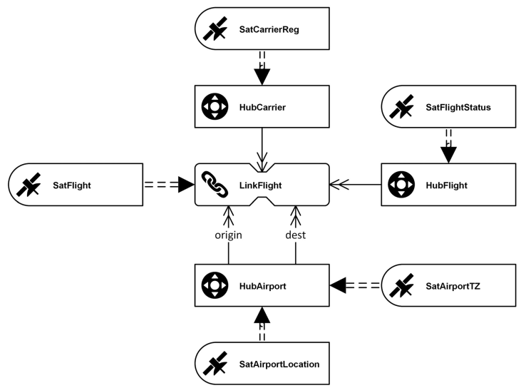
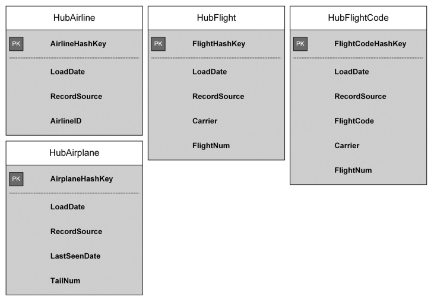
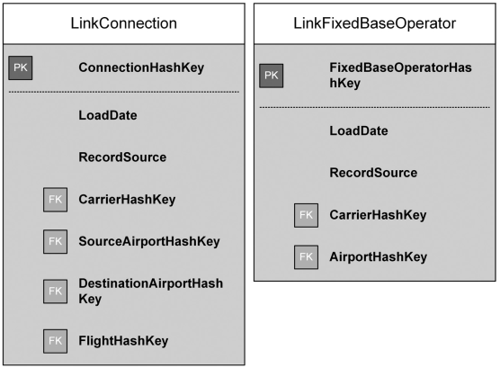
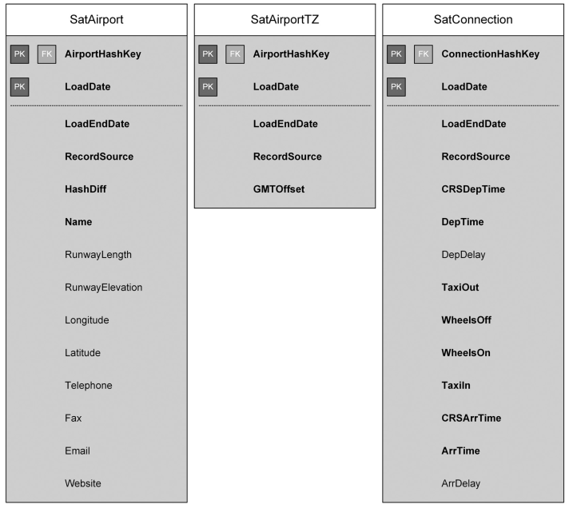

# Data Vault 2.0 Modeling

## Data Vault Modeling Vocabulary

The goal of the Data Vault model is to represent the businesss as closely as
possible, so the critical characteristics are:
- ability to react to rapidly changing business requirements, aka agility
- integration of various information sources
- complexity of business environment and sometimes organization itself
- flexibility to jump on new market opportunities
- transparency and accountability
- ability to respond to information requests with specialized and tailored reports
- ability to scale a business once it is successful

The Data Vault Model is based on three basic entity types, which are *hubs*, *links*,
and *satellites*. The hub separates the business keys from the rest of the model,
the link stores relationships between business keys (and/or jubs), and satellites
store the context (the attributes)

### Hub Entities

There are hubs for each type of business key. In the Data Vault, the business keys
are central and are therefore located in the hubs.

### Link Entities

Links connect two or more hubs.

### Satellite Entities

They store the attributes that belong to either a businesss key (in a hub),
relationship or a transaction (in a link). The sattelite also stores the history
of the attribute data. Every attribute change is logged to the satellite.

## Hub Definition

Business keys in the same hub should have the same semantic granularity. Business
key can be a composite key.
A hub tracks the arrival of a new business key in the data warehouse. A hash key
is used to reference the business object in other Data Vault entities. It improves
performance of data warehouse loads and joining business keys within the model.

The metadata from the hub (LoadData and RecordSource) should be placed at the beginning
of the entity to keep the design clean.

### Definition of a business key

Business keys are used to identify, track, and locate information. By definition,
it has a very low propensity to change and should be unique. Business keys are
supposed to have meaning to the business. E.g. customer numbers, vehicle identification numbers, employee badge numbers...

Some of them are smart keys: they are made up from other keys.

#### Composite Keys (aka Smart Keys, Intelligent Keys)

Composite keys are also known as smart or intelligent keys because the keys are given
business meaning through position values and formats.
In Visual Data Vault, the logical modeling language for Data Vault modeling, we distinguish
between composite keys and smarts keys: a composite key is made up of an unique combination
of columns, and smart keys is only a single column where the individual parts of the
business key are combined

#### Business Key Identification Process

Interviewing the business user is well.

#### Scope of Business Keys

A business has a scope in which the key is valid. Keys from an operational system
might be valid only in this specific operational system. Some may only be valid in 
a specific organizational unit (e.g. sales). The larger the scope, the better it can
represent the business object

#### Difference between Business Keys and Surrogate Keys

Surrogate keys are often used by operational systems to identify the business object,
but they are not good candidates for a business key ig the business is not using them.
Surrogate keys only help to technically identify a record uniquely in one source system.

### Hub Entity Structure

The following attributes are common for all Data Vault hubs:
- Hash key
- Business key(s)
- Load date
- Record source
- (Optional) Last seen date

#### Hash Key

The hash key is the primary key and serves as foreign key to reference. It is based
on the business key. It is used to improve lookup performance. When inserting data
into Data Vault with the ELT process, it checks whether the business keys in the source
already exist in the target hub.

Each unique business key in the hub must have a unique hash key. Hash keys should
be computed using MD5 or SHA-1. They must never be exposed to the business users and
outside. They are meaningless character strings only here to speed up and simplify
joins.

The hash key replaces the sequence number from the Data Vault 1.0 standard. It takes
more memory, but allows to join with other data sources (such as NoSQL databases).

#### Business Key

The business key attributes stores the business key as identified in the business key
identification process. There should be a unique indec on the business key to indicate
this characteristic.

In case of composite key, its sections can be split into separate fields within the hub.
Then the unique key shoukd span all fields. It's also possible to have the key as
single field, and also as separate fields (2 unique keys if so).

#### Load Date

The load date indicated when the business key initially arrived in the data warehouse.
It should be the same for all data that arrived in the same batch, to easily track
errors or loads problems. It must be a timestamp (date and time)

#### Record Source

To maintain traceability. If a given business key has multiple data sources, the record
source should indicate the master data source. We should use the lowest level of
granularity.

#### Last Seen Date

Change Data Capture (CDC) concept is supported by many RDBMS, to indicate when records
have been inserted, deleted, updated...
To detect changes, ETL has to perform a table scan over all rows and check for existence
in source data. All the business key of a same batch must have the same last seen date.
If a business key is not in the batch, this attribute should not be updated.

### Hub Examples

## Link Definition

Link entity is responsible for modeling transactions, associations, hierarchies and
redefinitions of busines terms. It doesn't capture time-lines or temporality: it
represent a link that exists of that existed in the past.

Data Vault links are implemented by tables that represent many-to-many relationships.
They contains hash keys of the two (or more) hubs it connects, along with metadata.
The primary key is a hash key

### Reasons for many-to-many relationships

Many benefits. They provide flexibility. By having many-to-many relationships everywhere,
if the business rules change (relation between two entities), it won't affect the 
data warehouse.

### Flexibility of Links

To add new functionality, we simply need to create hubs and link them using links
entities.

### Granularity of Links

The granularity is defined by the number of hubs that they connect. The more hubs it
connects, the finer the granularity becomes.

When we need to change the granularity of a link that is in production, there are
two options. First one, we modify the existing link, but it involves re-engineering
existing ETL jobs and the way historical data is handled in the new link lust also
be determined. For this reason, the modification of existing link structures is no
longer accepted.

The better option is creating a new link for new incoming data and "closing" the old
link. No new data can be added to the link table.

### Link Unit-of-Work

The unit-of-work is a correlated set of data that keeps key sets together. We can
split links into multiple smaller ones.

### Link Entity Structure

It has the following attributes:
- Hash key
- Load date
- Record source
- (Optional) Last seen date
- (Optional) Dependent child key

#### Hash Key

Same as in hubs. Used in ETL to check if data already exists in data warehouse
It is calculated from the combination of all business keys.

#### Dependent Child Key

Specific key valid only in the context of the link. E.g. a line-item number in a link
representing an invoice. It's called a *degenerate field*.

### Link Examples

### Satellite Definition

Satellites store all data that describe a business object, relationship or transaction.
The descriptive data in a satellite can change over the time (e.g. age). The purpose
of satellites is also to track these changes.

Data types should be as close as possible as the ones used in the source system.

Not all attributes are stored in one satellite. They are organized by business classification
or type of data and are stored in individual satellites by category.

Satellites are always dependent on maximum one other table.

### Importance of Keeping History

For auditability. So, it is forbidden to modify a record.

### Splitting Satellites

The goal is not to split all attributes into individual satellites. The recommendation
is to split the raw data first by source system and second by rate of change.

#### Splitting by Source System

Advantages:
- allows the designer to add new data sources without changing existing satellite
entities
- removes the need to alter incoming data so that it fits existing structures
- enables Data Vault model to keep the history of the source system and therefore keep
an audit trail for the system
- maximizes load parallelism because there is no competition

#### Splitting by Rate of Change

Split the attributes that are most frequently updated. The frequent ones are in one
satellite, and the less frequent ones in another. There could be more than two satellites
if there are more frequencies.

### Satellite Entity Structure

The attributes:
- Load Date
- Record source
- Parent hash key
- Load end date
- (Optional) Extract date
- (Optional) Hash diff

#### Parent Hash Key

It is part of the primary key, the other part if the load date. The parent hash key
references hub or link's primary key

#### Load Date

Second part of the primary key. It's the date and time the date warehouse has first
seen the data.

When loading historical data, we may need to set manually (to a past date) this attribute,
to avoid having old data overwriding last ones.

#### Load End Date

The date and time when the satellite becomes invalid. It is the only attribute that
is updated in a satellite. When inserting the new version of the satellite, we modify
this attribute of the previous record, which is the load date of the new record.

#### Hash Difference

It's a hash of all descriptive data of a satellite's entry. It helps comparing two
rows. It is possible to ignore some attributes in this calculation.

#### Extract Date

It captures the date and time when the data was extracted from the source system.
As it's a timestamp catpured on an unknown (sometimes) context, it is unreliable.
E.g. it may have been captured in a different time zone

### Satellite Examples

## References

- Linstedt, D, Super Charge Your Data Warehouse: Invaluable Data Modeling Rules to
Implement Your Data Vault, 2012, available as pdf ebook from
[http://learndatavault.com/books/super-charge-your-data-warehouse/](http://learndatavault.com/books/super-charge-your-data-warehouse/)
- Dörffler & Partner GmbH, Visual Data Vault (website), 2015, available at 
[http://www.visualdatavault.com](http://www.visualdatavault.com)
- Gibson Guitar, Community Forum website, 2008, available at 
[http://forum.gibson.com/index.php?/topic/765-duplicate-serial-number/](http://forum.gibson.com/index.php?/topic/765-duplicate-serial-number/)
- Michael Olschimke, Daniel Linstedt: “Visual Data Vault”,
[http://www.visualdatavault.com](http://www.visualdatavault.com)