# Intermediate Data Vault Modeling

These are the additional entities that can be found in the Business Vault extension. 

## Hub Applications

When data comes from different sources, there may be different keys to indentify the
same business object. In this case, the best way to handle it is to put all the objects
in the same hub, and create "same-as-link" ("SAL") to indicate business keys that identify
the same business objects.

### Business Key Consolidation

Business Vault can have Exploration Links, Computed Satellites, Computed Aggregate
Links...

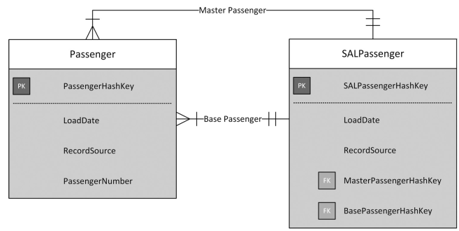

One other way to handle multiple source business keys, is to put all the objects in
the same hub, and add the source system as a part of its primary key. Another is
to create many hubs and link them.

## Link Applications

### Link-on-Link

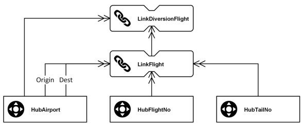

Changes in parent link (e.g. LinkFlight) required changes in child links (e.g.
LinkDiversionFlight). For this reason, link-on-link should be avoided

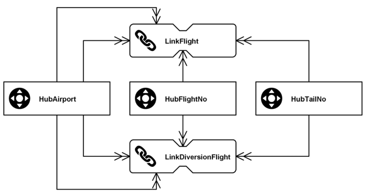

Links are now independent.

### Same-As Links

Mapping table to link one business object to the same, with identified by another
business key.

### Hierarchical Links

They represent parent-child hierarchy

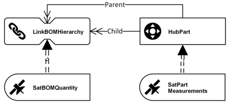

In an airplane, it may represents all its components, and sub-components

### Nonhistorized Links

A transaction links indicate a relationship that can't be updated.
E.g. link bewteen a CCTV camera and a photo it shots. It's impossible to add satellites,
all the attributes are then stored in the transaction link. To cancel a transaction
link, another one must be created (e.g. changing an invoice must delete the previous
one and create the new version)

Two options to physically model nonhistorized links. The first involves a standard link
entity and a satellite without LoadEndDate (so no new version can be inserted). 

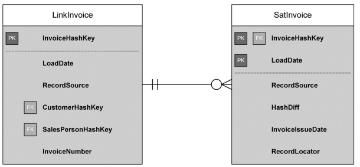
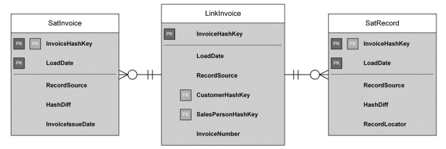

The second option (that should be avoided in most cases), is to add the attributes
directly to the link and abstain from using a satellite. 

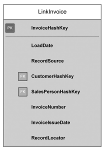

Not recommended because it changes the architectural design by introducing decision
to the design process.

### Nondescriptive Links

Links without descriptive attributes (satellites). Only representing a relationship.

### Computed Aggregate Links

A link may represent an aggregation functions, e.g. number of flight (link between
HubAirport and HubCarrier)

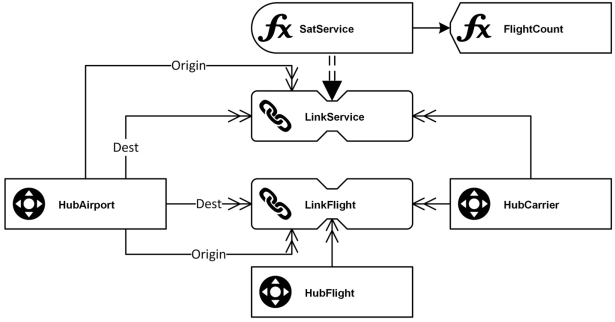

### Exploration Links

They are computed links created for business reasons only. Reasons to create them
can be:
- determine relationships and dynamic networks between business entities that are
not in the source system
- represent relationships that would be only indirect in the model otherwise
- consolidate links between business objects if one of the referenced hubs contains
duplicate entries (see same-as link)
- identify clusters of similar entries within hubs (see same-as links)
- automated discovery of patterns

## Satellite Applications

### Overloaded Satellites

Sometimes, we need to store data coming from different sources in the same satellites
(which is not recommended). Contradictions may happen. The following questions can
arise:
- which sources systems should be the master system if data is contradicting each other?
- which of the rows is the most current one?
- should be include RecordSource in the primary key?

### Multi-Active Satellites

Similar to overloaded satellites: they store multiple entries per parent key. But they
doesn't come from multiple data sources. We add a "Seq" (e.g. PhoneSeq) attribute as
part of the primary key, e.g. the position in the file. To avoid some issues with deltas
(when the order in the orginal file change), we may want to put another attribute instead
in the primary key.

### Status Tracking Satellites

Used to load audit trails of data from CDC systems. A sattelite with a Status attribute.
It could be "Deleted", "Updated", "Created"... CRUD operations.

### Effectivity Satellites

Indicates when a link is valid or not. One attribute (in a satellite) for "Begin"
timestamp and another for the "End".

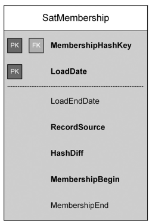

### Record Tracking Satellites

Equivalent of "LastSeen" attributes in hubs and links.

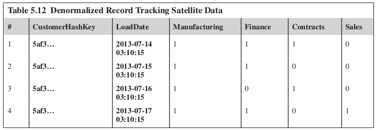
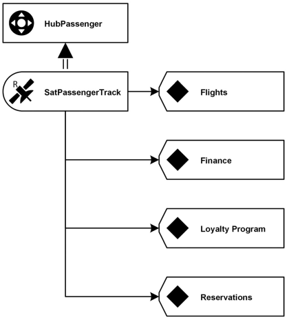

### Computed Satellites

Results of aggregations, summarization, correction, evaluation...